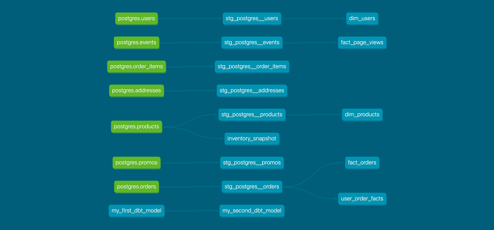

# Part 1 - Models

## What is our user repeat rate?
  + Repeat Rate = Users who purchased 2 or more times / users who purchased

``` sql
with user_orders as (
    select user_id, count(distinct order_id) as user_order_count 
    from stg_postgres__orders 
    group by 1)
, 
user_order_buckets as (select user_id, 
    (user_order_count = 1)::int as has_one_purchase,
    (user_order_count = 2)::int as has_two_purchases,
    (user_order_count = 2)::int as has_three_purchases,
    (user_order_count >= 2)::int as has_two_plus_purchases
    from user_orders)
select 
    sum(has_one_purchase) as users_with_one_purchase,
    sum(has_two_purchases) as users_with_two_purchases,
    sum(has_three_purchases) as users_with_three_purchases,
    sum(has_two_plus_purchases) as users_with_two_plus_purchases,
    count(distinct user_id) as count_users_with_purchases,
    div0(users_with_two_plus_purchases, count_users_with_purchases) as repeat_rate
from user_order_buckets
  ```
Answer: 0.798387 


## What are good indicators of a user who will likely purchase again? What about indicators of users who are likely NOT to purchase again? If you had more data, what features would you want to look into to answer this question?

NOTE: This is a hypothetical question vs. something we can analyze in our Greenery data set. Think about what exploratory analysis you would do to approach this question.

Answer: 

* Repeat purchases in the past 
* Recent purchases
* Frequent number of sessions 
* Browsing variety of product categories 
* Total value of orders 


## Explain the product mart models you added. Why did you organize the models in the way you did?

Only add one model in the products mart which is simply the staging products model filtered on page views. I didn't see a need to make this any more complicated. I also added the optional models within the `core` and `marketing` folders. 

## Use the dbt docs to visualize your model DAGs to ensure the model layers make sense 




# Part 2 - Tests

## What assumptions are you making about each model? (i.e. why are you adding each test?)

I added tests for the staging models from Week 1 and the fact and dim models from Week2. Specifically, I used the four built-in tests which dbt provides - `unique`, `not_null`, `accepted_values` and `relationships`. I went through the data for each column in each model to understand the data and made tests accordingly. So the key assumption I've made is that future data will pass the tests which have been created based on the existing data which may be invalid. 

## Did you find any “bad” data as you added and ran tests on your models? How did you go about either cleaning the data in the dbt model or adjusting your assumptions/tests?

I did not find bad data from my simple analysis but it's possible I overlooked something. 

# Part 3 - Snapshots

## Which products had their inventory change from week 1 to week 2? 

I ran `dbt snapshot` again but I didn't notice any changes. It seems no records have changed. 


