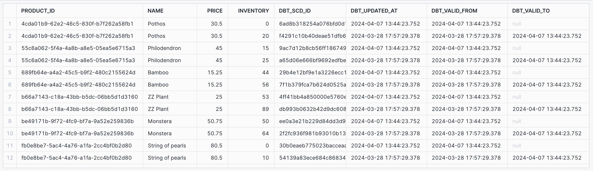

# Part 1: Create new models to answer the first two questions 

## What is our overall conversion rate?

* Created a model `int_user_sessions.sql` as follows: 

``` sql
select 
    session_id, 
    user_id, 
    min(created_at) as session_start_at, 
    max(created_at) as session_end_at, 
    sum(case when event_type = 'page_view' then 1 else 0 end) as page_view_count,
    sum(case when event_type = 'add_to_cart' then 1 else 0 end) as add_to_cart_count,
    sum(case when event_type = 'checkout' then 1 else 0 end) as checkout_count,
    sum(case when event_type = 'package_shipped' then 1 else 0 end) as package_shipped_count
from {{ ref('stg_postgres__events') }} 
group by 1, 2
```

* Ran the following query to answer the question: 

``` sql
select sum(checkout_count)/count(*) as conversion_rate from int_user_sessions 
```

* Answer: 0.624567 


## What is our conversion rate by product? 

* Created 3 models to help calculate this. 
  + `fact_session_product_views` - creates table where each row represents a product with a page view during a user session
  + `fact_session_product_orders` - creates table where each row represents a product which was ordered during a user session 
  + `fact_product_conversions` - creates table which (left) joins the two tables above so each row represent a product which was viewed during a session along with, optionally, relevant order columns if it was also ordered during the session. 
* Using these three models, the SQL below provides the product conversion rates in descending order. 


``` sql
with product_conversions as (
    select 
        product_id, 
        count(*) as session_view_count, 
        sum(case when order_id is not null then 1 else 0 end) as session_order_count, 
        session_order_count/session_view_count as conversion_rate 
    from fact_product_conversions 
    group by 1 
)
    select 
        product_conversions.product_id, 
        products.name, 
        product_conversions.session_view_count, 
        product_conversions.session_order_count, 
        product_conversions.conversion_rate from product_conversions 
    left join dim_products as products 
        on product_conversions.product_id = products.product_id 
    order by product_conversions.conversion_rate desc
```


# Part 2: We’re getting really excited about dbt macros after learning more about them and want to apply them to improve our dbt project. 

## Create a macro to simplify part of a model(s). 

* I created a macro `event_types.sql` as shown below to aggregate events per session. 
* This required using the `dbt_utils` package which I installed. 

``` sql








    ,sum(case when event_type = '{{ event_type }}' then 1 else 0 end) as {{ event_type }}_count



```
* I then changed the model to use the macro above and re-ran the model which worked as expected. 


``` sql
select 
    session_id, 
    user_id, 
    min(created_at) as session_start_at, 
    max(created_at) as session_end_at
    {{ event_types('stg_postgres__events', 'event_type') }} 
from {{ ref('stg_postgres__events') }} 
group by 1, 2
``` 


# Part 3: We’re starting to think about granting permissions to our dbt models in our snowflake database so that other roles can have access to them.

## Add a post hook to your project to apply grants to the role “reporting”. 

* Added the `grant` macro as per the week's content and the post-hook configuration in the `dbt_project.yml` file. 
* Checked the *Query History* in Snowflake and saw that the macro was executed successfully. 

``` sql


    
      GRANT USAGE ON SCHEMA {{ schema }} TO ROLE {{ role }};
      GRANT SELECT ON {{ this }} TO ROLE {{ role }};
    

    


```

``` yml
    +post-hook:
      - "{{ grant(role='reporting') }}"
```


# Part 4:  After learning about dbt packages, we want to try one out and apply some macros or tests.

## Install a package (i.e. dbt-utils, dbt-expectations) and apply one or more of the macros to your project

* I used the `dbt_utils` package in the macro used in Part 2. 

# Part 5: After improving our project with all the things that we have learned about dbt, we want to show off our work!

## Show (using dbt docs and the model DAGs) how you have simplified or improved a DAG using macros and/or dbt packages.


# Part 6. dbt Snapshots 

## Let's update our products snapshot again to see how our data is changing:

* Ran `dbt snapshot` and then ran the following query. 

``` sql
select inv1.* from inventory_snapshot as inv1 left join inventory_snapshot inv2 on inv1.product_id = inv2.product_id where inv2.dbt_valid_to is not null order by product_id
```

* The result was that 6 products had their inventories change as shown below. 


