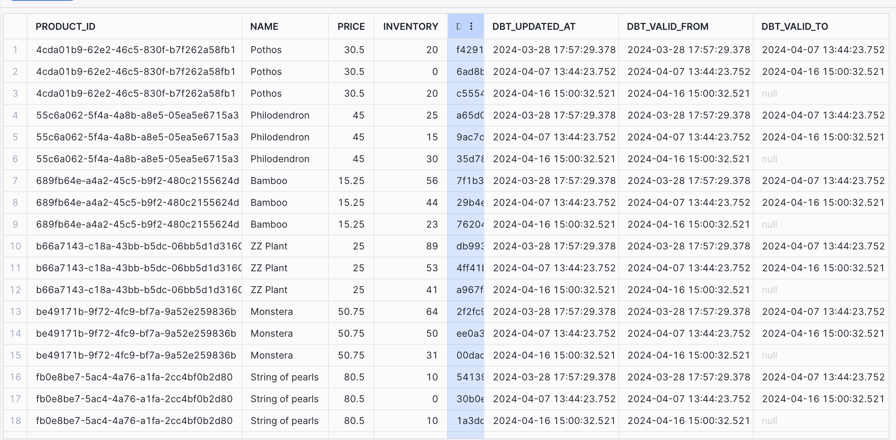
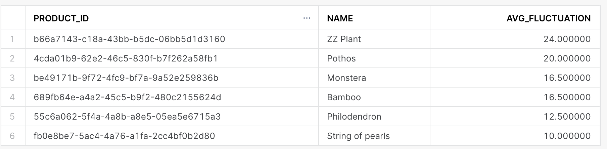
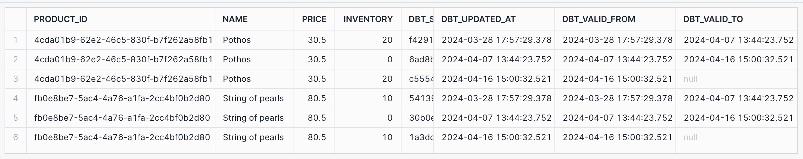

# Part 1: dbt Snapshots


## Which products had their inventory change from week 3 to week 4? 

* The products which have had their inventory change from week 3 to week 4 are shown below.

``` sql
select inv1.* from inventory_snapshot as inv1 left join inventory_snapshot inv2 on inv1.product_id = inv2.product_id where inv2.dbt_valid_to >= '2024-04-08' order by product_id, dbt_updated_at 
```





## Now that we have 3 weeks of snapshot data, can you use the inventory changes to determine which products had the most fluctuations in inventory? 

* The average fluctuation of inventory of products which had their inventory change is shown in the table below. 


``` sql
with inventory_changes as (
select distinct inv1.* from inventory_snapshot as inv1 left join inventory_snapshot inv2 on inv1.product_id = inv2.product_id where inv2.dbt_valid_to is not null order by product_id, dbt_updated_at 
),
inventory_deltas as (
select *, lag(inventory, 1) over (partition by product_id order by dbt_updated_at asc) as prev_inventory, inventory - prev_inventory as inventory_delta from inventory_changes
)
select product_id, name, avg(abs(inventory_delta)) as avg_fluctuation from inventory_deltas where inventory_delta is not null group by product_id, name order by avg_fluctuation desc 

```



## Did we have any items go out of stock in the last 3 weeks? 

* Based on the query results below, two products have gone out of stock: *Pothos* and *String of pearls*. 

``` sql
select distinct inv1.* from inventory_snapshot as inv1 left join inventory_snapshot inv2 on inv1.product_id = inv2.product_id left join inventory_snapshot inv3 on inv1.product_id = inv3.product_id where inv2.dbt_valid_to is not null and inv3.inventory = 0 order by product_id, dbt_updated_at
```



# Part 2: Modeling challenge

* The percentage of sessions where a user viewed a product who then went on to add a product to their shopping cart is **80.8%**. 
  + This is found by dividing the number of sessions with an *add to cart* event by the number of sessions with a *page view* event.
* The percentage of sessions where a user viewed added one or more items to their shopping cart and then went on to checkout is **77.3**. 
  + This is found by dividing the number of sessions with an *checkout* event divided by the number of sessions with an *add to cart* event. 

``` sql
select count(*) from int_user_sessions
select count(*) from int_user_sessions where page_view_count > 0
select count(*) from int_user_sessions where add_to_cart_count > 0
select count(*) from int_user_sessions where checkout_count > 0
``` 


# Part 3: Reflection questions -- please answer 3A or 3B, or both! 

## if your organization is thinking about using dbt, how would you pitch the value of dbt/analytics engineering to a decision maker at your organization?

dbt is a wonderful tool that allows data engineering and analytics teams to leverage and create data assets using the principles of composability and abstraction. Data assets (tables or views) can be readily built, using just SQL, on top of existing data assets and these new assets can in turn be used to create other assets. In effect, we can develop a directed acyclic graph and as such, we can create layers of data assets which are readily composable and usable. End users need only be concerned with the models which are most downstream while engineers can continually refine and develop models at each layer. 

dbt also has a variety of other useful dbt tools including the ability to generate documentation of models, their dependencies, their specfifications, etc. and have this documentation served online to relevant stakeholders. It also has the ability to capture changes in data via snapshots and to leverage pre-existing tests as well as create custom tests to ensure data is valid. It is also possible to import data from various sources using it *seeds* capability. We can also leverage macros to simpify and reuse our model definitions and to automate key tasks such as granting permissions. 

dbt has a broad adoption and can be used with all the major cloud datawarehouses as well as data orchestration tools such as Airflow and Dagster. 


